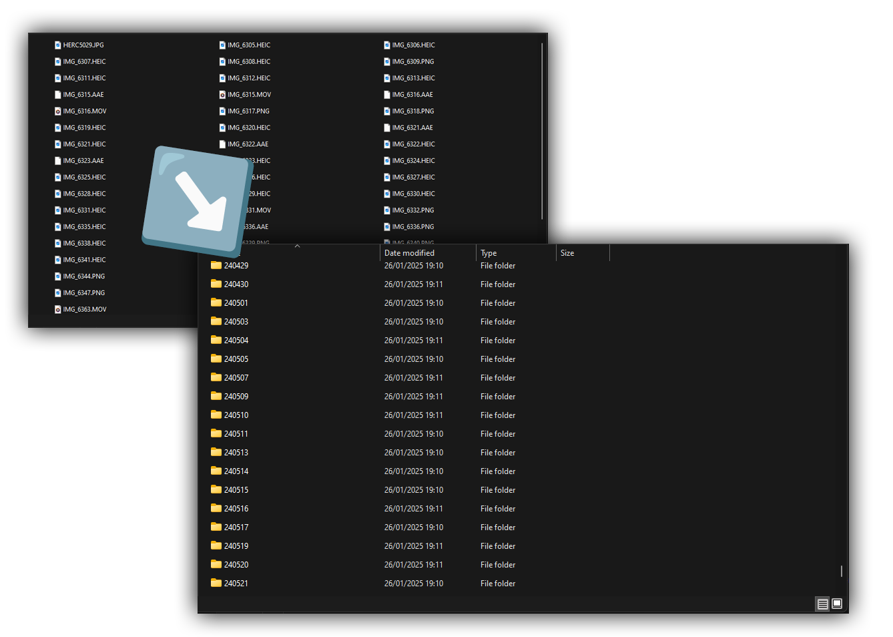

# Folderizer
```File Organizer Script 🗂️```

This PowerShell script organizes files in a directory based on their creation or EXIF date and moves them into a structured "Organized" folder. Each subfolder is named by date (e.g., `YYMMDD`), making it easier to manage and sort files such as images or documents.  



### Features:  
- Automatically detects and reads EXIF metadata for image files.  
- Falls back to the file's last modified date if EXIF data is unavailable.  
- Skips files already in the "Organized" folder.  
- A simple interactive prompt will start the process.  

Perfect for decluttering and organizing your file directories with a click! 🎉  

### How to Use:
1. [Download the latest version from the Releases page](https://github.com/neamax/folderizer/releases/tag/Windows). Move the `folderizer.ps1` file to the root of your images folder (the same folder where the images you want to get organised exist).
2. Open the `folderizer.ps1` file in PowerShell.
3. Press 'S' to start, and let it organize your files.
   All your photos will move to separated folders based on their date taken metadata, inside the "Organised" folder.

Enjoy a neat and organized directory! ✨